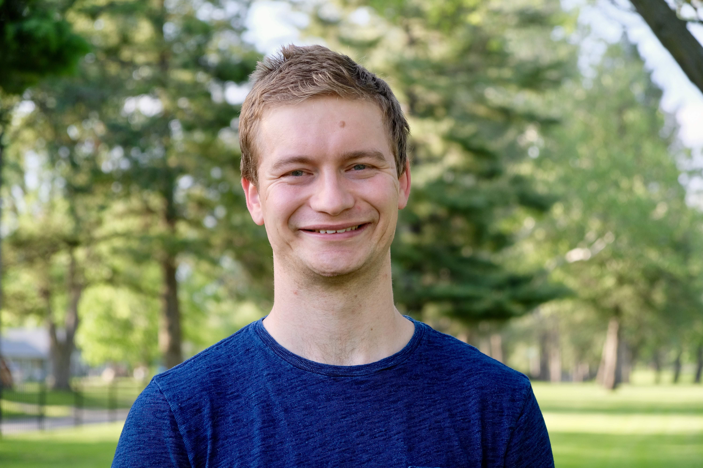

# Caleb Leedy

Postdoctoral Research Fellow · Ottawa, Canada

<a href="mailto:leedy.caleb@gmail.com">Email</a>
<a href="https://github.com/calebleedy">GitHub</a>
<a href="files/CalebLeedy_CV.pdf">Download CV (PDF)</a>

I am a postdoctoral research fellow at the University of Ottawa working with
David Haziza and Mehdi Dagdoug. Previously, I obtained my Ph.D.
in Statistics at Iowa State University under the supervision of Jae-Kwang Kim.
